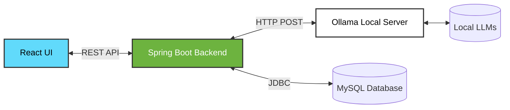

# ✨ LocalForge AI ✨

⭐ **React** | ⭐ **Spring Boot** | ⭐ **Ollama** | ⭐ **MySQL**

A powerful, locally-hosted AI chat application. LocalForge AI combines a responsive **React** frontend with a robust **Spring Boot** backend to seamlessly connect with a local **Ollama** model server. Chat with your local Large Language Models securely and entirely offline! 🌟

## ✨ Features

*   ⭐ **Local LLM Integration:** Connects directly to your local Ollama instance.
*   ⭐ **Dynamic Model Discovery:** Automatically fetches and displays available models from your Ollama server.
*   ⭐ **Modern UI/UX:** Built with React and styled beautifully with modern components.
*   ⭐ **Robust Backend:** Spring Boot architecture for reliable API routing, CORS handling, and optional MySQL conversation persistence.

## 🔥 What's New

*   🚀 **Unified System Launcher (`LocalForgeLauncher.java`):** A brand new GUI dashboard built with Java Swing to start, manage, and monitor live logs for your Backend, Frontend, and Ollama services all from a single window!
*   ⚡ **One-Click Start Script (`start_services.bat`):** A handy batch script that automatically cleans up hanging ports (8081, 5173, 11434), launches all required services in minimized windows, and opens your browser when everything is ready.

## �️ Why LocalForge AI?

In an era of cloud-based AI, **data privacy** is paramount. LocalForge AI allows you to harness the power of Large Language Models (LLMs) like Llama 3, Mistral, or Phi-3 without ever sending your sensitive data over the internet. 
*   🔒 **100% Offline Capable:** Once models are downloaded via Ollama, no internet connection is required.
*   💸 **Zero Subscription Fees:** Run powerful open-source models directly on your own hardware.
*   🎛️ **Full Control:** Manage your own chat history, model parameters, and system architecture.

## 🏗️ Architecture & Flow

The application follows a clean, decoupled client-server architecture designed for extensibility:

1.  **Frontend (React/Vite/Tailwind):** A fast, responsive Single Page Application (SPA). It handles user input, renders AI responses, and communicates exclusively with the Spring Boot API.
2.  **Backend (Spring Boot/Java 21):** Acts as a secure middleware layer. It manages CORS filtering (allowing configurable local network access), handles RESTful routing, and can persist conversational history using Spring Data JPA.
3.  **LLM Engine (Ollama):** The local inference server that loads the AI models into memory and returns generated text based on the backend's structured prompts.



## 🌟 Project File Structure

```text
LocalForge AI/
├── 🌟 backend/                           # Spring Boot Java backend
│   ├── src/main/java/com/localforgeai/
│   │   └── config/SecurityConfig.java    # CORS and Security configurations
│   ├── src/main/resources/
│   │   └── application.yml               # Backend runtime & database config
│   └── pom.xml                           # Maven dependencies
├── 🌟 src/                               # React application source code
│   ├── services/
│   │   └── api.ts                        # Frontend API base config & endpoints
│   ├── App.tsx                           # Main React component
│   └── main.tsx                          # React entry point
├── ✨ vite.config.ts                     # Frontend dev server & API proxy setup
├── ✨ package.json                       # Node.js dependencies & scripts
└── ✨ ATTRIBUTIONS.md                    # Project attributions and licenses
```

## ⭐ Requirements

*   ✨ **Node.js** (npm or pnpm)
*   ✨ **Java 21+** and **Maven**
*   ✨ **Ollama** installed and running locally
*   ✨ **MySQL** (Optional: for backend persistence of conversations)

## 🚀 Setup & Installation

**1. ✨ Install Frontend Dependencies:**
```bash
npm install
```

**2. ✨ Install Backend Dependencies:**
```bash
cd backend
mvn clean compile
```

**3. ✨ Ensure Ollama is Running:**
```bash
ollama serve
```

## 💻 Local Development Order

To ensure proper connectivity, start the services in this order:

1.  ⭐ **Ollama:** `ollama serve` (Recommended on `http://127.0.0.1:11434`)
2.  ⭐ **Backend:** `cd backend && mvn spring-boot:run` (Defaults to `http://127.0.0.1:8081`)
3.  ⭐ **Frontend:** `npm run dev -- --host 0.0.0.0` (or simply `npm run dev`)

> 🌟 **Note:** If you change backend CORS hosts (e.g., using a remote device address on your LAN), update the listed origins in `backend/src/main/java/com/localforgeai/config/SecurityConfig.java` and restart the backend.

## 🛠️ Commands Reference

### ✨ Frontend
*   ⭐ Install dependencies: `npm install`
*   ⭐ Run dev server: `npm run dev`
*   ⭐ Build for production: `npm run build`

### ✨ Backend
*   ⭐ Compile: `cd backend && mvn clean compile`
*   ⭐ Run server: `cd backend && mvn spring-boot:run`

### ✨ Full Validation Build
```bash
cd backend
mvn clean compile
cd ..
npm run build
```

## ⚙️ Backend Configuration

*   ⭐ **Backend Port:** `8081`
*   ⭐ **Ollama Host:** `http://localhost:11434` (Default)
*   ⭐ **Database:** MySQL datasource is configured in `backend/src/main/resources/application.yml`

### 🔌 Important API Endpoints

| Method | Endpoint | Description |
| :--- | :--- | :--- |
| ⭐ `GET` | `/api/ai/models` | Returns available Ollama models |
| ⭐ `POST` | `/api/ollama/chat` | Responds with generated text from the Ollama model (sync) |
| ⭐ `GET` | `/api/conversations` | Lists saved conversations (Requires persistence) |
| ⭐ `POST` | `/api/conversations` | Creates a new conversation (Requires persistence) |

## 🧠 Frontend Behavior

*   ✨ The dropdown model selector dynamically loads available models from `/api/ai/models`.
*   ✨ By default, the frontend uses the first available model returned by the backend.
*   ✨ If the backend is not running or Ollama is unavailable, the UI gracefully falls back to an empty model list.
*   ✨ The frontend is pre-configured to target `http://127.0.0.1:8081` as the backend base URL.

## 🚑 Troubleshooting

*   ⭐ **Port already in use:** If `ollama serve` fails with a bind error on `127.0.0.1:11434`, another Ollama process is likely running in the background. Use the existing process or stop it before restarting.
*   ⭐ **No models in dropdown:**
    1. Confirm the Spring Boot backend is running.
    2. Check if `http://127.0.0.1:8081/api/ai/models` returns a valid JSON response.
    3. Refresh your browser window.

## 💖 Acknowledgments & Attributions

*   🌟 UI Components proudly leverage shadcn/ui used under the MIT License.
*   🌟 Beautiful placeholder imagery sourced from Unsplash used under their License.